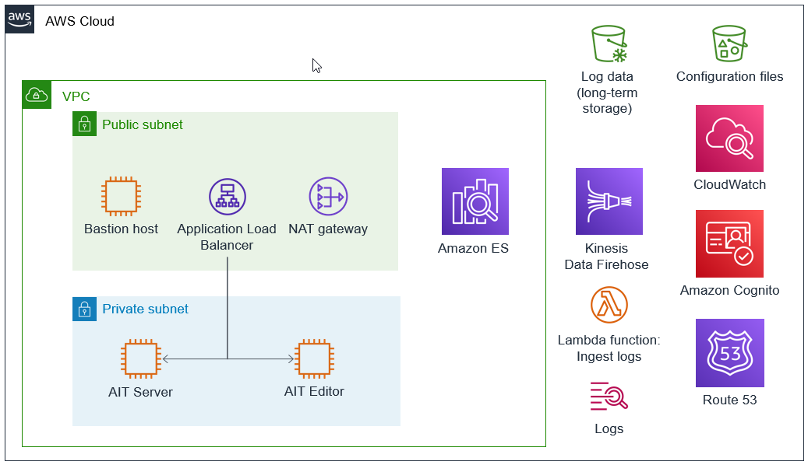

:xrefstyle: short

Deploying this Quick Start for a new virtual private cloud (VPC) with
default parameters builds the following {partner-product-short-name} environment in the
AWS Cloud.

// Replace this example diagram with your own. Follow our wiki guidelines: https://w.amazon.com/bin/view/AWS_Quick_Starts/Process_for_PSAs/#HPrepareyourarchitecturediagram. Upload your source PowerPoint file to the GitHub {deployment name}/docs/images/ directory in this repo.

[#architecture1]
.Quick Start architecture for {partner-product-short-name} on AWS

As shown in <<architecture1>>, the Quick Start sets up the following:

* A VPC configured with public and private subnets, according to AWS best practices, to provide you with your own virtual network on AWS.
* In the public subnet:
** A bastion host that ___.
//TODO Andrew, What to say about the bastion host?
** An Application Load Balancer to route traffic from the web to the appropriate application resources.
//TODO Andrew, Does the Application Load Balancer go outside the subnet? If so, please move the icon and this subbullet. (I've updated the .pptx file; work from the latest version in GitHub.)
** A network address translation (NAT) gateway to allow outbound internet access.
* In the private subnet:
** An Auto Scaling group that contains AIT Server, which exposes the AIT graphical user interface (AIT-GUI) and Open MCT application using Apache HTTP Server.
//TODO Andrew, Please add the Auto Scaling group to the diagram.
** An EC2 instance to serve the AIT Editor application using Docker.
* An Amazon Cognito user pool to manage identities and authenticate users.
* Amazon CloudWatch Logs log groups to receive log data from application servers from the CloudWatch Logs agent.
* Amazon Kinesis Data Firehose to deliver log data from CloudWatch Logs to Amazon S3 (for long-term storage) and Amazon Elasticsearch Service (Amazon ES).
//TODO Andrew, Do we want Amazon ES to be the only service icon inside the VPC?
* A Lambda function that ingests logs and prepares them for delivery to Kinesis Data Firehose.
* An S3 bucket that contains application and server configuration files.
* Amazon Route 53 to __
//TODO Andrew, please fill in the above blank.
//TODO Andrew, how could the diagram show the flow described here between some of these components?