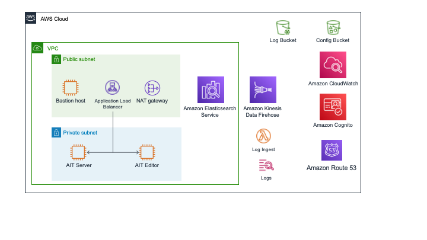

:xrefstyle: short

Deploying this Quick Start for a new virtual private cloud (VPC) with
default parameters builds the following {partner-product-short-name} environment in the
AWS Cloud.

// Replace this example diagram with your own. Follow our wiki guidelines: https://w.amazon.com/bin/view/AWS_Quick_Starts/Process_for_PSAs/#HPrepareyourarchitecturediagram. Upload your source PowerPoint file to the GitHub {deployment name}/docs/images/ directory in this repo.

[#architecture1]
.Quick Start architecture for {partner-product-short-name} on AWS

== QuickStart Components
As shown in <<architecture1>>, the Quick Start sets up the following:

* Cognito User Pool to manage identities and authenticate users
* Application Load Balancer to route traffic from the web to the appropriate application resources
* Auto Scaling Group containing the AIT Server (exposes AIT-GUI and OpenMCT applications via Apache HTTP Server)
* EC2 Instance serving the AIT Editor application via Docker
* CloudWatch LogGroups that receive log data from application servers via CloudWatch Logs Agent
* Kinesis Data Firehose delivers log data from CloudWatch Logs to S3 and AWS Elasticsearch Service
* Lambda Functions that preprocesses logs and prepares them for delivery to Kinesis Data Firehose
* S3 Bucket containing application and server configuration files

== Prereq Components
// Add bullet points for any additional components that are included in the deployment. Make sure that the additional components are also represented in the architecture diagram. End each bullet with a period.
Cover Pre-Deployment Resources here?

* VPC stack
** VPC
** Private Subnets for deploying the application servers and ElasticSearch Domain
** Public Subnets for deploying the Application load balancer and bastion servers
* Config stack
** S3 Bucket to hold project-specific application config files
** Custom resource to seed this bucket with default reference config files
** LINK: See <<pre-reqs.adoc#Configuration-Files-in-S3,Configuration Files in S3>> for more information on the contents of this bucket

[.small]#* The template that deploys the Quick Start into an existing VPC skips the components marked by asterisks and prompts you for your existing VPC configuration.#
