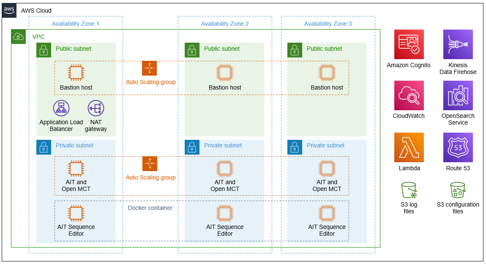

:xrefstyle: short

Deploying this Quick Start for a new virtual private cloud (VPC) with
default parameters builds the following {partner-product-short-name} environment in the
AWS Cloud.

[#architecture1]
.Quick Start architecture for {partner-product-short-name} on AWS

As shown in <<architecture1>>, the Quick Start sets up the following:

* A highly available architecture that spans two Availability Zones.
//TODO Andrew, What should we say (and show) here re: the third Availability Zone? See Aerospike for example: https://aws.amazon.com/quickstart/architecture/aerospike/).
* A VPC configured with public and private subnets, according to AWS best practices, to provide you with your own virtual network on AWS.
* In the public subnets:
** Managed network address translation (NAT) gateways to provide outbound internet access for resources in the private subnets.
** A Linux bastion host in an Auto Scaling group to allow inbound Secure Shell (SSH) access to Amazon Elastic Compute Cloud (Amazon EC2) instances in public and private subnets.
* In the private subnets:
** In one Auto Scaling group, an Amazon EC2 instance that serves the AIT and Open MCT applications using Apache HTTP Server.
** In another Auto Scaling group, an EC2 instance that serves the AIT Editor application using Docker.
* An Application Load Balancer to route traffic from the web to the EC2 instances in the private subnets.
* Amazon Cognito to manage identities and authenticate users.
* Amazon CloudWatch to receive log data from the EC2 instances in the private subnets using CloudWatch Logs agents.
* AWS Lambda to process logs for Amazon Kinesis Data Firehose.
* Kinesis Data Firehose to deliver log data from CloudWatch Logs to Amazon S3 and Amazon Elasticsearch Service (Amazon ES).
* Amazon Route 53 to provide a canonical name (CNAME) record, an alias for the Application Load Balancer.
* Two S3 buckets, one for long-term storage of log files and the other for application and server configuration files.