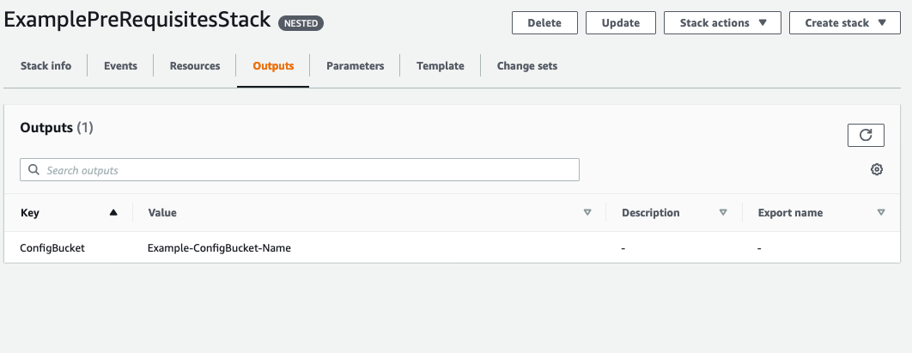

// If no preparation is required, remove all content from here

== Prepare your AWS account

// _Describe any setup required in the AWS account prior to template launch_

=== Deploy the preconfiguration stack
Before you launch the Quick Start, you must deploy a preconfiguration (prerequisite) stack. A preconfiguration stack is necessary because you need to make slight modifications before you provision the rest of the resources. (The modifications are detailed later under link:#_check_the_configuration_bucket_contents_and_replace_with_mission_specific_config_files[Check the configuration bucket contents and replace with mission-specific config files]). 

http://qs_launch_permalink[Deploy the preconfiguration stack^].

//TODO Andrew, What should this permalink point to?

=== Create service-linked role for Amazon ES
A service-linked role for Amazon ES is required for this Quick Start deployment. This role allows Amazon ES to call other necessary AWS services on your behalf during the Amazon ES provisioning process.

To create the role, see the https://docs.aws.amazon.com/IAM/latest/UserGuide/using-service-linked-roles.html#create-service-linked-role[Creating a service-linked role^].

When specifying the service name, use `es.amazonaws.com`.

For more information, see the https://docs.aws.amazon.com/elasticsearch-service/latest/developerguide/slr-es.html[Using service-linked roles to provide Amazon Elasticsearch Service access to resources^].

=== Check the configuration bucket contents and replace with mission-specific config files
During Quick Start deployment, an S3 bucket is created and populated with base configuration files for AIT Server, AIT Editor, and Open MCT.

In the AWS Cloudformation Console, select the newly-launch pre-requisite template, then the *Outputs* tab. Your configuration bucket is listed under the *ConfigBucketName* output variable.

[#configbucket1]
.Example configuration bucket output
[link=images/config_bucket_output.png]

To use your own configuration files, copy and overwrite files of the same name in the S3 configuration files bucket. For a layout of the configuration S3 bucket and an overview of available configuration files, see <<Configuration files in S3, Configuration files in S3>>.

IMPORTANT: Ensure that your configuration files have the correct syntax and format so that the applications deploy. For more information about AIT configuration, see the https://ait-core.readthedocs.io/en/latest/configuration_intro.html[AIT Documentation^].

=== (Optional) Import user-owned domain to Route 53
The deployment relies on a user-provided fully qualified domain name (FQDN). This FQDN is used to discover the ALB and subdomains to identify each application. The following records will be deployed in the user-provided Route53 Hosted Zone for each application:

    fqdn            →    ALB
    ait.fqdn        →    AIT ASG [apache → ait-gui bottle app]
    mct.fqdn        →    AIT ASG [apache → mct static built app]
    editor.fqdn     →    Editor EC2 Instance [docker container]
    logs.fqdn       →    Amazon ES/Kibana

For guidance on creating a Route 53 Hosted Zone, see: https://docs.aws.amazon.com/Route53/latest/DeveloperGuide/dns-configuring.html[AWS Docs - Configuring Route53 as your DNS Service]

If you choose not to use Route53, you are responsible for deploying the appropriate records as detailed in <<_dns_management>>. Additionally, you will need to import an SSL certificate into AWS Certificate Manager (ACM), as outlined below.

=== Import SSL certificate to ACM

This deployment applies an SSL certificate to the Application Load Balancer. This certificate can be imported manually into ACM, or generated as part of the deployment.

HTTPS is enabled on the ALB, requiring a valid SSL certificate for the FQDN. Additionally, the certificate should include the following alternative SANs (`*.{FQDN}` may be used):

- `ait.{FQDN}`
- `mct.{FQDN}`
- `editor.{FQDN}`
- `logs.{FQDN}`

This certificate needs to be available in ACM for attachment to the ALB. For details on requesting or importing a certificate with ACM, see the following:

- https://docs.aws.amazon.com/acm/latest/userguide/gs.html[AWS User Guide - ACM: Issue and Manage Certificates]
- https://docs.aws.amazon.com/acm/latest/userguide/import-certificate.html[AWS User Guide - ACM: Import Certificates]

If the `DomainName` and `HostedZoneID` parameters are populated, this deployment generates an ACM certificate. This deployment method uses DNS validation. All underlying DNS records relating to the ACM certificate will be created as necessary.

== Prepare for the deployment

// _Describe any preparation required to complete the product build, such as obtaining licenses or placing files in S3_

=== Configuration files in S3
For configuration and settings, an S3 bucket is created as part of the deployment and seeded with a set of default configuration files. Within the bucket, the configuration files have been organized by application with the following file structure:

//TODO Andrew, What are the actions that we need to take here? Since this section is part of "Prepare for the deployment," this content needs to be task-oriented.

----
configs
├── ait
│   ├── cloudwatch-agent-ait.json
│   ├── config
│   │   ├── bsc.yaml
│   │   ├── ccsds_header.yaml
│   │   ├── cmd.pkl
│   │   ├── cmd.yaml
│   │   ├── config.yaml
│   │   ├── core_set_op_mode.yaml
│   │   ├── evr.pkl
│   │   ├── evr.yaml
│   │   ├── leapseconds.dat
│   │   ├── limits.pkl
│   │   ├── limits.yaml
│   │   ├── table.yaml
│   │   ├── tlm.pkl
│   │   └── tlm.yaml
│   └── httpd_proxy.conf
├── editor
│   └── cloudwatch-agent-editor.json
└── modules
    └── openmct-static.tgz
----

==== configs/ait/
Files in this S3 path are configuration files for the AIT deployment within this Quick Start.

===== cloudwatch-agent-ait.json
This file is used to configure the CloudWatch agent that will run on the AIT EC2 server instance. If you would like to add additional sources for logs that will be sent to CloudWatch Logs, edit this config to enable those new log sources.

For more information about modifying the CloudWatch agent configuration file, see the https://docs.aws.amazon.com/AmazonCloudWatch/latest/monitoring/CloudWatch-Agent-Configuration-File-Details.html[AWS CloudWatch agent documentation].

===== config/
All files in this S3 path are configuration files for the AIT application. These files can be modified and overwritten in S3 to customize the AIT server installation. The main configuration file is `config.yaml`, however any of the other files may be modified or overwritten depending on your needs.
//TODO: "The main configuration file is `config.yaml`" this implies that this file should not be overwritten?

===== config.yaml
This file is the main configuration file for AIT. On the AIT EC2 service instance, this file is located at `/home/ec2-user/AIT-Core/config/config.yaml`.

This main configuration file references a few other configuration files (filepaths are relative) as well as enabling a default set of AIT plugins - AIT GUI, the Data Archive plugin for InfluxDB, and the AIT Open MCT plugin.

For more information on this file, see the https://ait-core.readthedocs.io/en/latest/configuration_intro.html#config-yaml[AIT documentation].

===== httpd_proxy.conf
This configuration file defines how Apache HTTP Server proxies requests to either AIT or Open MCT. Both applications are set up as virtual hosts in Apache. Requests to AIT get proxied to the AIT backend Python process while requests to Open MCT are handled directly by the Apache web server which is serving Open MCT’s static files.

This file typically does not need to be modified unless you want a non-standard configuration for routing traffic between applications. For more detailed information on how to modify this file, please see the https://httpd.apache.org/docs[Apache HTTP Server Project documentation].

==== configs/editor/
Files in this S3 path are configuration files for the AIT Editor deployment within this Quick Start.

===== cloudwatch-agent-editor.json
This file is used to configure the CloudWatch agent that runs on the AIT Editor EC2 server instance. If you would like to configure additional sources for logs that will be sent to CloudWatch Logs, edit this config to enable those sources.

For more information about modifying the CloudWatch agent configuration file, see the https://docs.aws.amazon.com/AmazonCloudWatch/latest/monitoring/CloudWatch-Agent-Configuration-File-Details.html[AWS CloudWatch agent documentation].

==== configs/modules/
Files in this S3 path are static files that are served via Apache HTTP Server.

===== openmct-static.tgz
This file is a tarball of the static files for Open MCT. The JavaScript files in the tarball have been minified and bundled.

If you would like to modify the Open MCT framework or configure/install plugins for Open MCT, you may make your changes, create a new tarball, and then upload new file to overwrite the existing file in S3.
